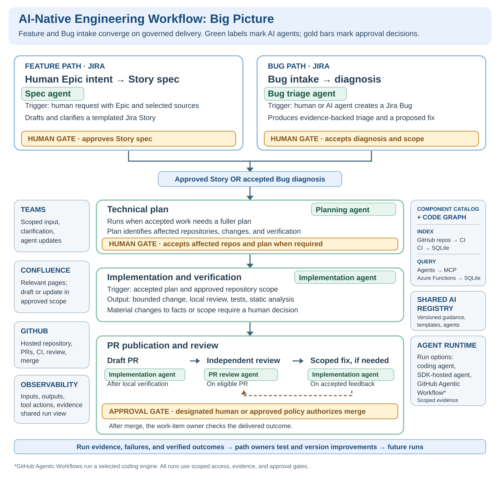
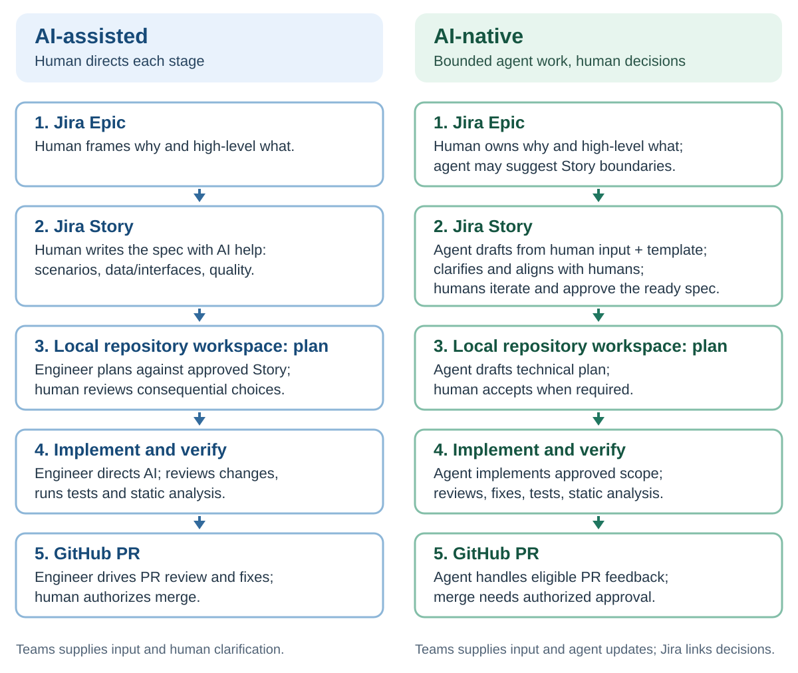
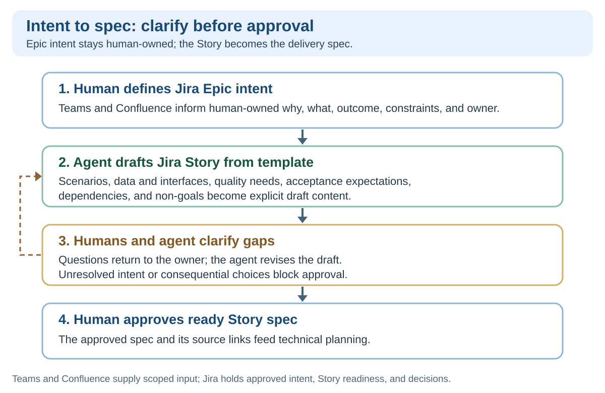
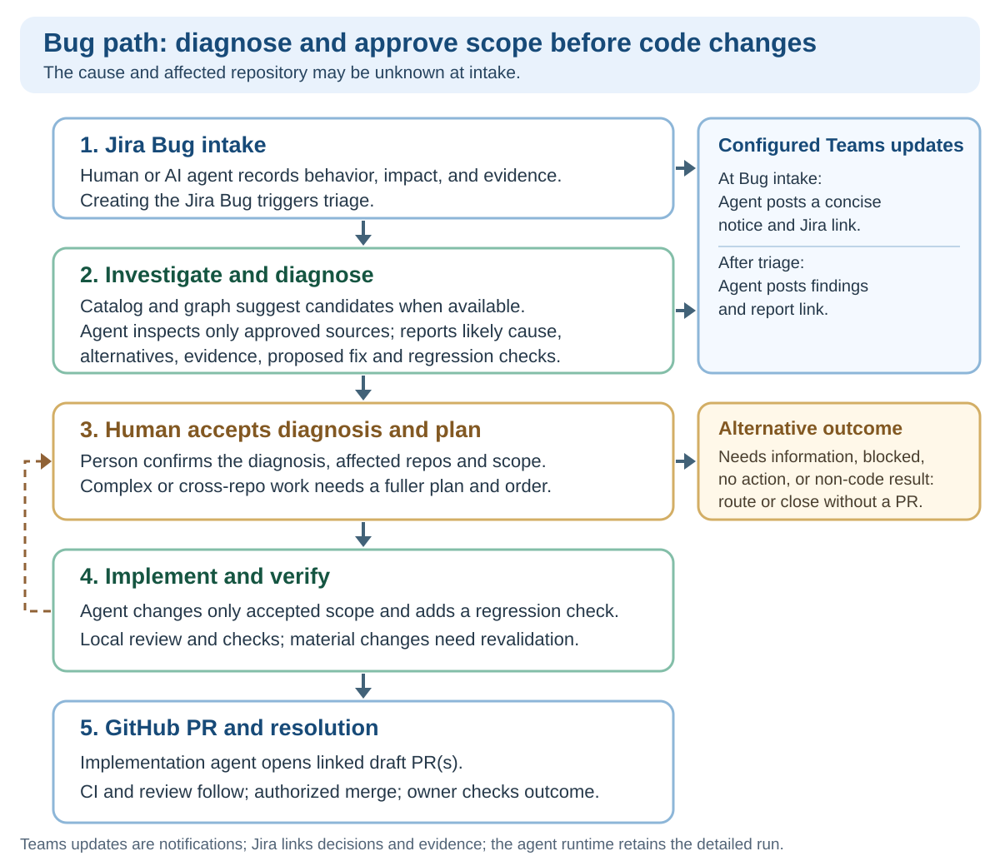
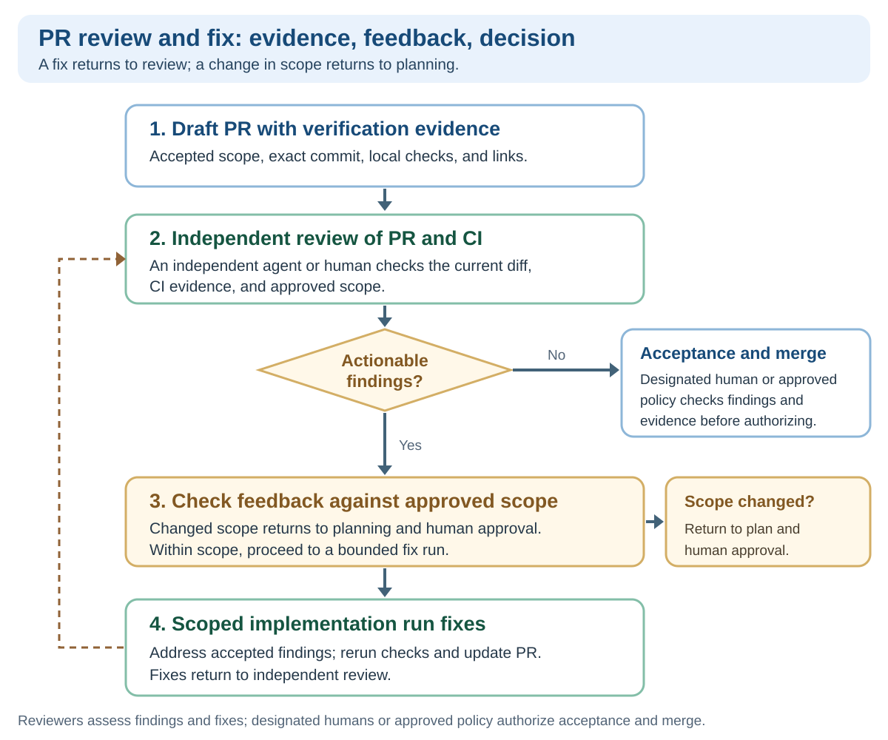

# AI-Native Engineering Workflow Vision

## Vision

AI-native engineering helps teams turn intent into **useful, verified changes with less repeated investigation and manual coordination**. Engineers frame problems, explore solutions, and make consequential decisions. Agents carry out bounded work, preserve context across handoffs, and return evidence and exceptions.

**Teams maintain these reusable workflows as engineering capabilities.** Each delegated task has an accountable owner, defined authority, and observable results. Teams use delivery outcomes, operational feedback, and total engineering effort to improve the workflows over time.

The workflow spans existing Jira, Teams, Confluence, GitHub and its code repositories, shared discovery, the AI registry, agent runtime, and observability. Each system retains its authoritative records.

Green labels identify AI-agent work; gold bars identify human decisions. The development plan selects execution forms for each workflow slice.

## Pace, Quality, and Efficiency

For each recurring class of work, a paved path defines the ready input, agent work, evidence, and human decision. This vision depends on named human owners continuously maintaining these paths: inspecting traces and outcomes, correcting failures, testing improvements, and releasing new versions. Without that work, the paths cannot reliably deliver sustained gains in pace, quality, and efficiency. Teams retain ownership of their repositories and decisions; proven improvements are shared across the organization.

- **Pace:** Agents can investigate, plan, code, and verify ready work while reliable handoffs keep it moving. Human owners maintain clear inputs, current repository knowledge, working exception routes, and enough review capacity to accept the work.
- **Quality:** Each stage preserves accepted intent, scope, and verification requirements. Tests, CI, independent review, and human assessment examine the change and its assumptions, including missing scenarios and inadequate checks. Findings and defects improve future context, checks, and guidance.
- **Efficiency:** Shared repository knowledge and reusable assets reduce repeated investigation and setup. Agents handle bounded execution while engineers focus on architecture, risk, and acceptance. Owners refine task eligibility and run configuration using the total human effort, compute, coordination, and rework per accepted outcome.

Teams expand paths when the gains in accepted outcomes justify the added specification, review, recovery, and maintenance effort within agreed quality, risk, and cost expectations. The maintenance loop is concrete: a missed dependency can lead to a better index, a recurring review finding to a stronger check, and a stalled handoff to improved routing. Owners test and version these changes before sharing them across teams.

**Teams simplify or retire workflows that do not deliver worthwhile improvements.**

## What Teams Can See and Decide

Starting from a Jira Story, a person can find answers to four questions in the item or its authoritative links, without reconstructing a Teams thread or an agent conversation:

1. **Why and what?** The outcome, authoritative context, scope and non-goals, acceptance expectations, dependencies, and decision owner.
2. **Can it be delegated?** Its readiness, permitted agent actions, constraints, risk or approval boundary, and the evidence required before acceptance.
3. **What is happening?** Current state, responsible human or agent run, next action, and any blocker or failure that needs a decision.
4. **What happened?** The accepted plan when one is required, linked run and GitHub artifacts, checks actually performed, unresolved uncertainty, and final human disposition.

A short Story can carry this directly; larger work can link an approved brief or design in Confluence. Agent-generated Story text is a proposal until the accountable person confirms intent and readiness. Agent-written Confluence content follows the page's ownership and review policy.

The lifecycle needs distinct meanings for **intake, ready, active, review, blocked, failed, and accepted**. Labels may follow the team's Jira configuration, but a stopped agent is not automatically a completed task, an opened PR is not an accepted change, and a merged PR is not proof of a deployed or successful outcome. Every transition identifies the next responsible actor.

## Composable Workflow Slices

Teams can adopt a slice without automating adjacent work. Each slice has an input, an agent contribution, a durable handoff, a human decision boundary, and an exception route.

Teams can begin with approved repositories, reviewed local guidance, and reviewable run records. Every adopted slice still needs an accountable owner, explicit authority, evidence, and an exception route. Shared discovery, registry, and observability services extend these capabilities as adoption grows.

| Slice | Work and durable handoff | Human boundary and exception |
| --- | --- | --- |
| Epic intent → Story spec | Agent drafts and clarifies the spec from human intent, selected Teams conversations, relevant Confluence pages, and a template. | Human owns Story boundaries and readiness; missing intent returns for clarification. |
| Bug intake → diagnosis | A Jira Bug created by a human or AI agent triggers triage. The agent uses catalog and graph candidates when available, or identifies approved repositories directly, to produce an evidence-backed diagnosis and proposed fix with concise team-channel updates. | Human accepts the diagnosis or routes `needs_information`, `blocked`, or `no_action`. |
| Approved spec or diagnosis → technical plan | Agent plans changes, dependencies, and verification against a known repository baseline; narrow Bug triage may suffice. | Human accepts affected repositories and consequential choices. |
| Accepted plan → implementation and local verification evidence | Agent makes bounded changes, reviews the diff, runs checks, and records evidence. | Materially changed facts or scope require renewed approval; failed required checks remain visible. |
| Local verification evidence → draft PR | Implementation agent validates the commit and required evidence, opens linked draft PRs, and records any missing checks. | Reviewers assess readiness; designated humans or an explicitly approved policy decide acceptance. |
| PR review → fix | An independent agent or human reviews the PR; a scoped implementation run addresses accepted feedback and records fixes and rechecks. | Reviewers assess finding resolution; scope changes return for approval. |
| Accepted PR → merge and outcome | Link review, CI, merge, and work-item results. | Designated humans or an explicitly approved policy authorize merge; the work-item owner confirms the outcome. A non-code Bug can close without a PR. |

## Feature Work: AI-Assisted And AI-Native Paths

Assistance and delegation can be combined throughout engineering work. People retain product direction and consequential architecture decisions. Agents can undertake bounded investigations, compare options, and run authorized experiments before a delivery specification is complete. These tasks produce evidence or recommendations for a human decision.

**Implementation delegation requires accepted intent, sufficiently clear scope, authorized actions, and an agreed way to assess the result.** Routine actions can proceed under an agreed policy; consequential choices require a named person.

In assisted work, a person coordinates the stages and carries context between them. In delegated work, the workflow preserves context and evidence, advances authorized work, and routes exceptions to the responsible person. For example, before approving a performance change, an engineer can delegate an investigation comparing two approaches; its result supports the design decision rather than becoming production code.

## Feature Stage Contracts

The stages have different responsibilities: the Epic retains high-level intent rather than becoming a detailed implementation ticket, and the Story retains the reason the work matters.

| Stage | Durable content and decision to advance |
| --- | --- |
| Jira Epic | Human-owned intent: why this matters, the high-level what and intended outcome, key constraints, and decision owner. Selected Teams conversations and relevant Confluence pages can supply input; a person confirms the Epic intent and decides any Story decomposition suggested by agents. |
| Jira Story | The agent drafts a delivery spec from human input, including selected Teams conversations and relevant Confluence pages, and a provided Story template. It asks clarifying questions and aligns the content with humans as they iterate. The spec covers the work needed to fulfill the intent, scenarios, data and interfaces, quality requirements, acceptance expectations, dependencies, and non-goals. Humans approve it only when ready; unresolved intent or consequential design decisions block implementation. |
| Local repository workspace | Technical plan, implementation, and verification in a local workspace for the designated existing GitHub repository, against a known baseline. Local review, fixes, relevant tests, and static analysis happen before proposing the change; the evidence names what actually ran and what remains uncertain. |
| GitHub PR | The PR links the Story, diff, commit, CI results, review findings, and fixes. Merge follows the applicable human or policy approval; the Jira Story records the outcome. Merge does not by itself prove deployment or product success. |

The work-item owner identifies how the intended outcome will be checked after delivery. Operational or user evidence informs subsequent work and workflow improvements.

## Bug Path

A Jira Bug is its own work item, not a mandatory Epic-to-Story conversion. A human or AI agent can create it, and creation triggers triage. It may link to an Epic or incident when relevant. At intake, the cause and even the affected repository may be unknown. Triage establishes a supported diagnosis and proposed fix; a person accepts the diagnosis and scope before code changes begin.

| Step | Agent and system work | Human decision or gate |
| --- | --- | --- |
| 1. Jira Bug intake | A human or AI agent creates the Bug with observed and expected behavior, reproduction evidence, impact, environment, and available logs or links. Creation triggers triage; the agent asks for missing information and can post a concise Bug notice with the Jira link to the designated Teams channel. | A person owns the report and responds to missing information or the triage result. |
| 2. Triage in existing repositories | Inspect only approved repositories; distinguish reporter claims from source or reproduction evidence. Report likely cause and alternatives, affected repositories, commit/path/line evidence, proposed fix, regression checks, limitations, and questions. Post a concise investigation result and report link to the designated Teams channel. | A person answers material questions; the resolution is recorded or linked from Jira. `needs_information`, `blocked`, and `no_action` do not proceed to implementation. |
| 3. Accept diagnosis and plan | The triage report proposes the smallest coherent fix and verification plan. Preserve the exact report/run and repository baseline being accepted. | A person confirms the diagnosis, affected repository set, and scope. For complex or cross-repository work, review a fuller technical plan and dependency order before implementation. An agent's `ready_for_implementation` is not authorization. |
| 4. Implement and verify | An implementation agent changes only the accepted repositories and scope, adds a meaningful regression check, reviews the diff, and runs relevant local tests and static analysis. It stops if the facts or required scope materially change. | Failed or unavailable required checks remain visible; the result is not presented as ready for review without the agreed evidence. |
| 5. GitHub PR and resolution | The implementation agent publishes linked draft PRs after local validation. GitHub CI and review drive corrections; linked PRs show cross-repository ordering. Teams brings questions and exceptions to the owner. | Designated humans or an explicitly approved policy authorize merge. **The Bug owner identifies who will verify the original failure in the relevant environment**; Jira records or links the merge, subsequent verification, and final disposition. A non-code finding may resolve or route the Bug without a PR. |

New information or a changed repository baseline triggers a check that the accepted diagnosis, scope, and verification approach still apply. Material changes to scope or assumptions require renewed human acceptance. Triage restarts when the diagnosis may no longer hold. Otherwise, the run records the revalidation and continues within its existing authority. Verification covers the actual proposed code.

## PR Review And Fix

This slice can be adopted for an eligible feature or Bug PR without automating the earlier stages. An independent agent or human reviewer uses the accepted scope, current diff, and verification evidence. Accepted findings lead to a scoped implementation run for fixes and rechecks; feedback that changes scope returns to planning and human approval.

Within its authorized scope, the implementation agent can publish draft PRs. An independent agent or human can review the proposed change and report findings. Reviewers assess their resolution; **designated humans or an explicitly approved policy decide acceptance and merge**.

## Responsibilities Across Tools

Jira tracks feature and Bug intent, status, and links to decisions and evidence; it is one of several collaboration surfaces. Teams provides scoped conversation input for work such as Epic and Story creation, as well as a channel for agent questions and updates. Confluence provides maintained knowledge for agents to read and, within approved scope, a place to draft or update documentation. Together these systems make delegation visible and controllable from intent to accepted outcome.

Agents run as coding-agent sessions or SDK-hosted services; [GitHub Agentic Workflows](https://github.github.com/gh-aw/introduction/overview/) can host coding-agent runs for repository workflows. Commands can start runs, skills guide the work, and templates structure outputs. Coding agents can implement, verify, and publish draft PRs within approved scope. Each run uses a configured, authorized trigger and the same scoped task, trace, result, evidence, and human-approval contracts. Shared discovery reduces repeated repository investigation; agents verify catalog and graph candidates against the source baseline before acting.

| Surface | Responsibility in the target workflow | Boundary |
| --- | --- | --- |
| Jira | Epic intent; Story spec; Bug report, triage and accepted diagnosis; readiness, work-item ownership and state, approvals, and links to decisions and evidence | Does not become the record for every technical decision, discussion, or execution log |
| Teams | Scoped conversations can supply Epic and Story input and human clarification. Authorized agents can ask questions and post configured updates, including Bug notices and investigation results, to designated channels | Retain links to source messages and durable results; chat alone is not an approved intent, spec, decision, or verification record |
| Confluence | Maintained product, architecture, decision, and operational pages supply context; authorized agents can draft or update pages as part of an approved task | Preserve page ownership, source links, version history, and required human review; do not duplicate Jira approvals or repository-owned facts |
| Component catalog and code graph | Component catalogs and source live in GitHub repositories. CI validates catalog records, derives tree-sitter-based code graphs, and refreshes both in SQLite. Agents query the index through read-only MCP APIs on Azure Functions for component, owner, dependency, and code-navigation candidates | Catalog and graph matches guide investigation; agents verify against the source baseline and gain no repository access from a match |
| Shared AI registry | Versioned guidelines, templates, agent and skill specifications, and evaluations guide human and agent work across teams | Publishing an asset does not grant an agent permission or replace team-owned repository context |
| Local repository workspace | Technical plan, implementation, local review, fixes, tests, and static analysis in a workspace for an approved GitHub repository; a branch or worktree may isolate the work | A local pass does not replace review and CI on the proposed commit |
| GitHub | Hosted repository and branches, proposed diff, PR discussion and fixes, CI results, and merge record | A green check or model review does not make the acceptance decision |
| Agent runtime | Routes authorized tasks to a compatible execution form; enforces claim or lease, isolation, limits, run events, artifacts, outbound action results, and failure evidence | An agent cannot grant itself more scope or authority through a prompt |
| Observability | A shared run view linked from the work item shows triggers, input and output traces, tool actions, evidence, failures, human decisions, and agent and asset versions for every execution form | Enforce scoped access, redaction, and retention; retain Jira and GitHub as authoritative records for work state and code |

The work item links stable Jira item, relevant Teams messages and Confluence pages, run, commit, and PR identifiers without duplicating source records. Teams carries selected input, directed questions, and configured updates; agents do not ingest every channel or broadcast every step. Confluence page changes remain traceable to the work item and the responsible owner.

## Company-Scale Operating Model

For 30+ repositories and 20+ teams, standardize the essential guarantees across teams: ownership, authority, state meanings, evidence, and recovery. These form a common workflow contract while teams use different workflows and tools to meet them. Each engineering team maps it to its Jira setup and owns its repository set, context, checks, reviewers, permitted Teams conversation sources and posting routes, and Confluence read and write scope. The shared AI registry versions reusable guidance; team profiles select applicable assets, and runs record their concrete versions.

A work item may span repositories, teams, and PRs. Agents use the catalog and graph when available to find candidates, or identify candidate repositories directly; they verify source and ownership evidence before people confirm the affected set, dependencies, and decision owners. Results include source version, freshness, and known gaps. Stale or missing index data requires direct inspection or human clarification. Discovery does not grant access: agents receive access only to approved repositories. Partial completion and cross-team blockers remain visible. Shared dispatch limits and run records expose review and recovery queues.

Roll out by task family and team profile. Test cross-repository and cross-team handoffs before scaling; compare accepted outcomes, review burden, failures, and cost rather than agent activity or adoption.

## Leadership Conditions for Scale

Leaders use accepted outcomes, review queues, defects, run traces, and team feedback to find the current engineering bottleneck, whether in planning, design, implementation, verification, or review. Investment follows that constraint; lines of AI-generated code are not a measure of progress.

Teams have protected time and generous, observable token capacity to experiment with agent workflows. Engineers share useful discoveries through demos, hackathons, and dedicated channels. Path owners evaluate promising practices and release tested, reusable versions through the shared AI registry.

Leaders stay close to architecture, agent behavior, and review capacity while teams own repository-level decisions. Clear decision owners and escalation routes keep consequential choices accountable and routine work moving.

Each adopted workflow has a named owner and allocated maintenance capacity. Team leaders resolve ownership gaps and identify decision owners for cross-team disagreements. Engineers have time to develop agent-evaluation skills and maintain the system knowledge needed to challenge results and recover from failures.

## Related Guidance

This document applies the repository's [governed agentic development](governed-agentic-development.md) system model, [AI-native product management](ai-native-product-management.md) context and decision boundary, [phased adoption](ai-native-engineering-phases.md), and [pipeline measurement](agent-pipeline-optimization.md) guidance to the cross-tool workflow. The [AI asset registry](ai-asset-registry.md) and [context-system guidance](agent-context-systems.md) describe the separate governance and retrieval foundations. Those documents remain the source for detailed design and evaluation criteria.

## Appendix: Planning Missions And Pilot Scope

Each workflow slice has its own mission; enabling missions apply across slices. These are inputs to a development plan, not a commitment to build a new platform. Assess existing capabilities first.

| Workflow mission | Required result for planning |
| --- | --- |
| 1. Epic intent → Story spec | Define how selected Teams conversations, relevant Confluence pages, and other human input inform Epic intent and Story drafting; the Story template, agent clarification, spec readiness, accountable approval, and the return path for missing intent or consequential decisions. |
| 2. Bug intake → diagnosis | Define the Jira Bug creation trigger and evidence, catalog and graph candidates, approved repository inspection, triage output, Teams notices and findings summaries, human questions, and `needs_information`, `blocked`, or `no_action` outcomes. |
| 3. Approved spec or diagnosis → technical plan | Define repository baseline, affected-set and dependency confirmation, plan content and verification approach, when the triage report suffices, and when human acceptance of a fuller plan authorizes implementation. |
| 4. Accepted plan → implementation and local verification evidence | Define permitted changes, local review and fixes, tests and static analysis, verification evidence linked to the exact commit, and how failed checks or materially changed facts stop work or reopen the plan. |
| 5. Local verification evidence → draft PR | Define validation and evidence requirements for agent-created draft PRs, cross-repository links, and the separate decision that makes a PR ready for review. |
| 6. PR review → fix | Define independent review, a scoped implementation run for accepted feedback, findings and fix evidence, rechecks, reviewer decisions, and escalation when feedback changes the approved scope. Keep agent handling of PR feedback outside the initial Bug pilot. |
| 7. Accepted PR → merge and outcome | Define human or policy merge approval, work-item acceptance, the difference between merge and deployment or product success, and Bug resolution or routing without a PR. |

| Enabling mission | Required result for planning |
| --- | --- |
| 8. Select and baseline a pilot | Name one team, repository group, task family, and first workflow slice; map its current Jira-to-merge path, waiting time, review load, rework, and quality signals. Define improvement without increasing risk or human burden. |
| 9. Provide trusted discovery and shared assets | Define GitHub catalog ownership and validation; CI generation and SQLite refresh of catalog records and tree-sitter code graphs from repository source; Azure Functions MCP retrieval; coverage, freshness, and permission-aware candidates; applicable registry assets, team profiles, and recorded versions. Confirm how candidates become an approved repository set. |
| 10. Establish cross-tool trust | Confirm Jira, Teams, Confluence, GitHub, and discovery MCP integration; identities, credential scope, permitted Teams conversation retrieval and posting, Confluence page retrieval and editing, source links, caller visibility, data handling, audit requirements, and the source of truth for each state change. Reconcile stale records, conflicting pages, failed or duplicate notifications, and other events. |
| 11. Govern agent execution and recovery | Select pilot execution forms and eligible task policy. Define dispatch, single claim or lease, repository baseline, isolation, permitted actions, run tracing, time and cost limits, cancellation, retries, and recovery after partial work. |
| 12. Coordinate human decisions | Define intake, ready, active, review, blocked, failed, and accepted meanings; owners and dependencies; what Jira displays or links; which Teams exchanges can inform or clarify work, which agent events post to designated channels or alert owners, and how a person answers, rejects, or accepts a result without watching a live chat. |
| 13. Operate and improve every workflow | Assign owners and a review cadence; use run traces and representative cases to compare accepted outcomes, lead time, waiting, rework, escaped defects, review effort, failures, and cost with the baseline. Check catalog and graph coverage, freshness, false or missed matches, and unauthorized exposure. Diagnose recurring failures, then test, version, release, or roll back changes to agents, assets, checks, integrations, data, permissions, and human process. |

The development plan can then name the selected task family, current tool capabilities and gaps, owners, integration sequence, contracts and state transitions, security controls, evaluation cases, rollout gates, and explicit exclusions. The remaining integration choices and estimates depend on those mission outputs.

### Pilot Boundaries

Start the bug pilot with Jira Bug creation triggering triage, a manual implementation trigger, explicit acceptance of one triage run, draft PRs, and normal human GitHub review. Scheduled intake, agent handling of PR feedback, and automatic merge are later possibilities, not pilot assumptions. Other issue types need their own input, routing, and acceptance contract before using this path.

An end-to-end feature pilot carries one approved Epic through agent-drafted Story, human clarification and approval, repository work, PR review and fixes, and human-authorized merge. Selected Teams conversations and Confluence pages can inform the Epic and Story; authorized agents can propose linked Confluence updates where maintained documentation needs to change. Teams carries agent questions or updates; Jira links approved content, progress, and the final decision. The pilot grants no agent merge, deployment, priority-change, or production authority. Expand autonomy only after reliable outcomes and recoverable failures.
